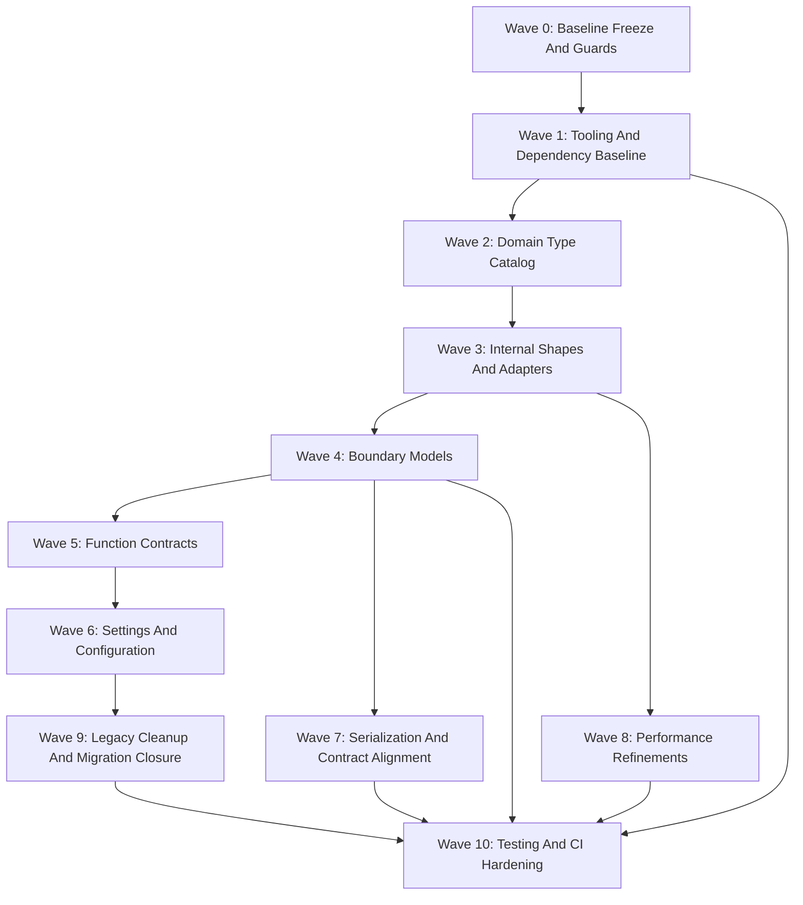

# Helaicopter Python Backend Type-System Master Plan

## Executive Summary

Helaicopter's Python backend already uses modern Pydantic v2 across FastAPI, local store DTOs, and OATS runtime artifacts, but it is still at an intermediate maturity level: contracts exist, semantics are duplicated, internal shapes are often anonymous, and there is no enforced static-type or lint baseline. The target state is a phased, strict backend type system where meaning-bearing domain types sit above reusable validation utilities, `TypedDict + TypeAdapter` handles lightweight internal payloads, `BaseModel` is reserved for true contract boundaries, and pyright/ruff/CI become real enforcement mechanisms instead of optional cleanup work.

The major architectural moves are:
- keep Python `>=3.13`, `uv`, and `setuptools`, and keep current runtime dependencies stable;
- add a backend tooling baseline in `pyproject.toml` with `pyright`, `ruff`, `pytest-cov`, and existing test tooling;
- introduce a shared backend domain package at `python/helaicopter_domain/` for IDs, vocabularies, and semantic `Annotated` scalars;
- replace raw internal dict seams in `helaicopter_api.application`, `helaicopter_db`, and selected OATS paths with `TypedDict + TypeAdapter` at ingress;
- keep `schema/` as HTTP-only `BaseModel` boundaries, keep `ports/` as integration/store DTOs only, and keep `python/oats/models.py` as durable artifact contracts in the first rollout;
- centralize alias/casing policy and stop relying on family-local `_to_camel` helpers plus blanket `populate_by_name=True`;
- unify backend settings late, after boundary and payload work, so configuration cleanup does not stall the higher-value type architecture work.

The biggest risks are pyright adoption blocking delivery before the initial scope is reduced, API casing regressions on legacy conversation/analytics surfaces, semantic drift around `project_path`, and introducing unnecessary runtime overhead by validating repeatedly in hot paths.

## Current-State Inventory

- **Python/runtime baseline:** `pyproject.toml` already requires Python `>=3.13`; backend stack includes FastAPI, Pydantic, `pydantic-settings`, SQLAlchemy, Alembic, DuckDB, Typer, and Uvicorn.
- **Dependency manager/build:** `uv` + `setuptools` are already the repo baseline.
- **Backend layout:** primary Python backend areas are `python/helaicopter_api`, `python/helaicopter_db`, and `python/oats`.
- **Pydantic usage:** broad and already v2-style. Major concentrations are:
  - `python/helaicopter_api/schema/*.py`
  - `python/helaicopter_api/ports/*.py`
  - `python/oats/models.py`
- **Static typing status:** no committed pyright configuration; intake reports a 53-error pyright trial scan. Existing friction is consistent with the repo sample: `app.state` ignores in `server/dependencies.py`, `cast(dict[str, Any], ...)` in `application/plans.py`, raw helper parsing in `application/conversations.py`, and test doubles based on `SimpleNamespace`.
- **Linting status:** no committed Ruff configuration.
- **Testing status:** pytest is present and there are meaningful API/OpenAPI tests under `tests/`; no repo-local CI workflow is present. Tests currently use dynamic fakes in several modules.
- **Config management status:** there is one `BaseSettings` entry point in `python/helaicopter_api/server/config.py`, but `python/helaicopter_db/settings.py` still uses direct `os.getenv` parsing and OATS keeps its own repo config contract in `python/oats/models.py` and `python/oats/repo_config.py`.
- **Schema/boundary maturity:**
  - query models in `schema/conversations.py` and `schema/analytics.py` already use `extra="forbid"`;
  - several HTTP families (`database`, `evaluations`, `orchestration`, `subscriptions`) each define their own camel-case base plus `_to_camel`;
  - `ports/` contains real DTOs, but also embedded `dict[str, Any]` seams such as plan steps, task payloads, and raw conversation fields;
  - `python/oats/models.py` is a durable local artifact contract and is materially different from transient internal parsing shapes.
- **Performance-sensitive areas observed in code:**
  - conversation JSONL parsing and shaping in `python/helaicopter_api/application/conversations.py`;
  - codex plan parsing in `python/helaicopter_api/application/plans.py`;
  - analytics aggregation in `python/helaicopter_api/pure/analytics.py`;
  - OATS artifact loading in `python/helaicopter_api/adapters/oats_artifacts/store.py`;
  - database/status payload normalization in `python/helaicopter_api/application/database.py`.

## Target-State Architecture

### Type Hierarchy

1. **Meaning first:** shared domain aliases and vocabularies in `python/helaicopter_domain/`
   - nominal IDs
   - provider/status/scope/runtime literals or enums
   - semantic path/value aliases via `Annotated[...]`
2. **Lightweight internal shapes:** `TypedDict` plus cached `TypeAdapter`
   - anonymous parsed JSON
   - task payloads
   - plan step payloads
   - export envelopes
   - narrowed Codex/Claude line payloads
3. **Boundary schemas:** `BaseModel` only where the contract is durable or externally visible
   - HTTP request/response models in `schema/`
   - integration/store DTOs in `ports/`
   - durable artifact contracts in `python/oats/models.py`
4. **Function contracts:** `@validate_call(config=ConfigDict(strict=True), validate_return=True)` on exported application/service boundaries only
5. **Configuration contracts:** one canonical backend `BaseSettings` tree for API + DB tooling, with OATS repo config explicitly kept separate

### Validation Boundary Policy

- Validate once at ingress, then transform many times.
- Replace raw helper parsing in `application/conversations.py`, `application/plans.py`, `helaicopter_db/export_types.py`, `helaicopter_db/status.py`, and selected refresh/status helpers with typed structural shapes plus cached adapters.
- Do not decorate routers, Typer commands, tiny mapping helpers, or hot inner loops with `validate_call`.
- Prefer parsing inbound `Any` or JSON into typed structures before business logic rather than wrapping permissive helpers with decorators.

### Schema Boundary Policy

- `python/helaicopter_api/schema/`: HTTP-only request/response models.
- `python/helaicopter_api/ports/`: integration/store DTOs and protocols only.
- `python/oats/models.py`: durable local artifact contracts, retained as `BaseModel` in the planned rollout.
- Public opaque `dict` payloads should be replaced with named models or explicitly documented opaque JSON wrappers.
- Public polymorphic HTTP payloads should use discriminated unions, especially conversation blocks.

### Alias And Serialization Strategy

- Internal Python naming remains `snake_case`.
- Long-term canonical external naming is `camelCase`.
- Conversation and analytics HTTP surfaces remain legacy `snake_case` until an intentional versioned migration exists; they are deferred, not blessed forever.
- Shared HTTP base classes/utilities should replace family-local `_to_camel` helpers.
- Inbound alias acceptance and `extra` policy must be explicit per HTTP request/query model.
- Blanket `populate_by_name=True` stops being the default posture.

### Config Strategy

- Keep `python/helaicopter_api/server/config.py` as the canonical backend settings entry point.
- Split it into nested settings sections over time while keeping the `HELA_` prefix.
- Remove the implicit `Settings()` fallback from `build_services` during the settings wave, not earlier.
- Migrate `python/helaicopter_db/settings.py` and Alembic/DB tooling onto the shared settings contract later in the rollout.
- Keep `python/oats` repo config separate from backend runtime settings.

### Performance Guardrails

- No `TypeAdapter(...)` creation inside loops.
- Avoid `BaseModel -> model_dump -> model_validate` chains on hot paths unless crossing a real boundary.
- Trusted fast paths are allowed only after an explicit validation boundary exists and tests cover the assumption.
- Priority hot paths:
  - app-local SQLite conversation list/detail loading;
  - analytics aggregation;
  - JSONL parsing for conversations and plans;
  - OATS artifact listing.

## Specialist Agent Dispatch Summary

| Specialist | Scope | Top Recommendation | Key Dependency | Major Risk |
|---|---|---|---|---|
| Dependency/bootstrap | Tooling baseline | Keep runtime deps stable; add `pyright`, `ruff`, `pytest-cov`, keep one install story | none | over-expanding tooling before migration plan |
| Static typing | pyright rollout | `tool.pyright`, strict, Python 3.13, narrow initial include | Wave 1 baseline | turning pyright on repo-wide too early |
| Ruff/annotations | lint policy | Curated ruleset, include `ANN` but not `ANN401` initially | Wave 1 baseline | annotation churn in tests and dynamic seams |
| Domain semantics | shared meaning types | Create `python/helaicopter_domain/` | after baseline, before broad refactors | over-modeling before hotspots are known |
| Internal shapes/adapters | transient raw payloads | Replace dict islands with `TypedDict + TypeAdapter` | domain aliases | repeated adapter construction or over-validation |
| Boundary model policy | HTTP/store/OATS boundaries | keep `schema/`, `ports/`, and `oats/models.py` separate by responsibility | internal shape cleanup | one model reused across incompatible layers |
| Serialization/schema | alias and casing policy | centralize casing utilities; defer legacy snake_case migrations | boundary policy | breaking existing frontend contracts |
| Functional contracts | service entrypoints | apply `validate_call` only on exported typed boundaries | internal ingress parsing | decorating Any-heavy helpers and hot code |
| Settings/secrets | config unification | one backend `BaseSettings`; OATS separate | later-wave dependency | stalling rollout on config work |
| Performance/hot paths | validation overhead | validate once, transform many; use adapter singletons | internal-shape work | hidden regressions in hot loops |
| Migration/legacy debt | rollout safety | phased waves; target architectural debt, not nonexistent v1 debt | all prior waves | compatibility shims lingering too long |
| Testing/CI | enforcement | required `ruff + pytest`, pyright advisory then required | baseline + later wave outputs | gates outpacing codebase readiness |

## Conflict Register

1. **`BaseModel` vs `TypedDict + TypeAdapter`**
   - **Conflict:** some recommendations push away from `BaseModel`, but `schema/`, `ports/`, and `oats/models.py` already contain contract-bearing models.
   - **Resolution:** keep `BaseModel` at real boundaries; replace only transient, anonymous, internal payloads with `TypedDict + TypeAdapter`.
   - **Consequence:** `ports/` keeps DTO ownership, but embedded weak fields such as `steps: list[dict[str, Any]]` and task payloads must be typed or wrapped.

2. **Legacy snake_case analytics/conversations vs long-term camelCase**
   - **Conflict:** canonical external casing should be camelCase, but existing analytics/conversations are legacy snake_case surfaces.
   - **Resolution:** treat those families as deferred legacy contracts. Keep them stable now, add explicit tests, and revisit only through a versioned API migration.
   - **Consequence:** new HTTP families should use shared alias policy immediately; legacy families do not silently drift.

3. **Whether shared domain semantics lands before or alongside refactors**
   - **Conflict:** centralizing semantics too early can become speculative; too late causes repeated churn.
   - **Resolution:** land a minimal domain catalog first, then grow it alongside boundary/internal-shape work.
   - **Consequence:** Wave 2 establishes only high-reuse semantics: IDs, provider/status/scope/runtime vocabularies, and the `project_path` split.

4. **How to make pyright real without blocking delivery**
   - **Conflict:** strict pyright is desired, but 53 current errors make repo-wide enforcement unrealistic.
   - **Resolution:** advisory pyright starts on a narrow include; required status begins only when that initial backend scope is green; scope expands wave by wave.
   - **Consequence:** pyright becomes enforceable early for a limited surface, not late for the full repo.

5. **Settings unification order**
   - **Conflict:** shared settings are desirable, but configuration cleanup touches API, DB tooling, and bootstrap wiring.
   - **Resolution:** keep settings unification after boundary and internal-shape cleanup.
   - **Consequence:** `build_services(settings=None)` remains temporary debt until the settings wave.

6. **How to treat `python/oats/models.py`**
   - **Conflict:** OATS models could theoretically move toward structural typing, but they currently represent durable on-disk artifacts.
   - **Resolution:** keep them as durable `BaseModel` contracts for this program; revisit structural typing only after OATS runtime/artifact formats are stable.
   - **Consequence:** OATS helper payloads may gain typed adapters, but `models.py` is not a first-wave rewrite target.

## Decision Ledger

### Settled

- Keep Python `>=3.13`, `uv`, and `setuptools`.
- Keep current runtime dependencies unchanged for now.
- Add dev dependencies: `pytest`, `pytest-cov`, `httpx`, `pyright`, `ruff`.
- Use `[tool.pyright]` in `pyproject.toml`, not `pyrightconfig.json`.
- Start pyright on `python/helaicopter_api/server`, `schema`, `ports`, and `python/oats/models.py`, then expand.
- Introduce `python/helaicopter_domain/` as the shared backend domain package.
- Use `TypedDict + cached TypeAdapter` for transient internal dict payloads.
- Keep `schema/` as HTTP-only models, `ports/` as integration/store DTOs, and `python/oats/models.py` as durable artifact contracts.
- Centralize alias utilities and stop defaulting to blanket `populate_by_name=True`.
- Keep one canonical backend `BaseSettings` entry point and keep OATS repo config separate.
- Make pyright advisory before it becomes required.
- Split `project_path` into at least three distinct semantics: encoded project key, absolute filesystem path, and display path.
- Treat analytics and conversation casing migration as a versioned internal decision, not one blocked by known external clients.
- Proceed with nested `BaseSettings` design without special DB/Alembic environment-loading constraints.
- Keep the current hot-path list as the Wave 8 priority set; no additional backend hot paths are currently identified.

### Deferred

- Versioned migration of legacy snake_case analytics/conversation APIs to camelCase.
- Possible future structural typing migration for parts of OATS outside `models.py`.
- Coverage gates beyond targeted architecture and contract tests.
- Wider pyright expansion to tests and `python/helaicopter_db` until earlier waves are green.

### Blocked Pending Review

- None currently. Initial review questions were resolved in favor of:
  - splitting `project_path` into encoded key, absolute path, and display path;
  - assuming no external clients block a future versioned analytics/conversations casing migration;
  - proceeding without special DB/Alembic environment-loading constraints for nested settings.

## Dependency Graph

Sequencing rule:
- pyright enforcement expands only after the current included scope is green;
- boundary-model cleanup depends on the domain catalog and first internal-shape conversions;
- settings unification waits until boundary semantics are explicit;
- performance work follows explicit ingress validation, not vice versa.

## Rollout Waves

### Wave 0 - Baseline Freeze And Guards

- **Goal:** freeze current contract behavior, record the starting pyright error baseline, and declare migration guardrails before code churn begins.
- **Files likely touched:** `pyproject.toml`, future CI workflow path, architecture tests under `tests/`, planning docs.
- **Acceptance criteria:** documented backend scope; no new family-local alias helpers; no new public raw `dict[str, Any]` payloads introduced; initial pyright baseline captured.
- **Key risks:** baseline drift while the rollout is still being defined.

### Wave 1 - Tooling And Dependency Baseline

- **Goal:** establish one backend development toolchain and a non-blocking CI lane.
- **Files likely touched:** `pyproject.toml`, `.github/workflows/*`, test/lint/type docs if present.
- **Acceptance criteria:** dev group includes `pytest`, `pytest-cov`, `httpx`, `pyright`, `ruff`; `[tool.pyright]` and `[tool.ruff]` are committed; CI requires `ruff` and `pytest`; pyright runs in advisory mode on the initial backend scope.
- **Key risks:** enabling too many Ruff rules or too wide a pyright scope on day one.

### Wave 2 - Domain Type Catalog

- **Goal:** create the minimum shared domain package needed to remove duplicated literals and ambiguous primitives.
- **Files likely touched:** `python/helaicopter_domain/`, `python/helaicopter_api/schema/*`, `python/helaicopter_api/ports/*`, `python/oats/models.py`, selected `helaicopter_db` modules.
- **Acceptance criteria:** repeated provider/status/scope/runtime vocabularies are centralized; nominal ID aliases exist for high-value identifiers; `project_path` semantics are split into explicit types.
- **Key risks:** over-designing the domain package before real reuse is proven.

### Wave 3 - Internal Shapes And Adapters

- **Goal:** eliminate the highest-value raw internal dict seams with `TypedDict + TypeAdapter`.
- **Files likely touched:** `python/helaicopter_api/application/conversations.py`, `python/helaicopter_api/application/plans.py`, `python/helaicopter_api/application/database.py`, `python/helaicopter_db/export_types.py`, `python/helaicopter_db/status.py`, selected OATS runtime helpers.
- **Acceptance criteria:** first target payloads are typed at ingress; adapters are cached/singleton-style; no per-loop adapter construction; the initial pyright scope is materially cleaner.
- **Key risks:** performance regressions if validation is added in the wrong place; duplicated shape definitions if ownership is unclear.

### Wave 4 - Boundary Models

- **Goal:** make boundary ownership explicit and remove inappropriate public/internal `dict` usage.
- **Files likely touched:** `python/helaicopter_api/schema/*.py`, `python/helaicopter_api/ports/*.py`, adapter return-shaping code, conversation block schemas.
- **Acceptance criteria:** `schema/` is HTTP-only, `ports/` is integration/store DTO only; public opaque dicts are replaced or wrapped; conversation polymorphism uses discriminated unions where appropriate.
- **Key risks:** accidental schema churn on existing HTTP routes, especially conversations and analytics.

### Wave 5 - Function Contracts

- **Goal:** add strict function contracts to exported application/service boundaries after ingress typing is in place.
- **Files likely touched:** `python/helaicopter_api/application/*.py`, selected `python/oats/runner.py` and orchestration service entry points.
- **Acceptance criteria:** exported service functions use `validate_call(..., validate_return=True)` where inputs/outputs are typed; routers, tiny helpers, parsers, and hot loops remain undecorated.
- **Key risks:** decorating Any-heavy code before it is typed enough to benefit.

### Wave 6 - Settings And Configuration

- **Goal:** converge backend runtime settings under one canonical `BaseSettings` contract.
- **Files likely touched:** `python/helaicopter_api/server/config.py`, `python/helaicopter_api/bootstrap/services.py`, `python/helaicopter_db/settings.py`, Alembic/DB tooling entry points.
- **Acceptance criteria:** one backend settings entry point exists; nested settings sections are introduced where useful; `build_services` no longer silently creates `Settings()`; DB tooling reads from the shared backend settings contract.
- **Key risks:** environment-loading regressions in DB tooling and refresh flows.

### Wave 7 - Serialization And Frontend Contract Alignment

- **Goal:** centralize alias behavior and harden schema serialization contracts.
- **Files likely touched:** shared schema base utilities, `python/helaicopter_api/schema/database.py`, `schema/evaluations.py`, `schema/orchestration.py`, `schema/subscriptions.py`, route/OpenAPI tests.
- **Acceptance criteria:** family-local `_to_camel` helpers are gone; HTTP bases make alias acceptance explicit; casing-focused contract tests and OpenAPI fragment assertions exist; legacy snake_case families are explicitly documented as deferred.
- **Key risks:** breaking existing consumers by changing alias acceptance or response casing accidentally.

### Wave 8 - Performance Refinements

- **Goal:** remove avoidable validation overhead and clean up hot-path model churn.
- **Files likely touched:** `python/helaicopter_api/adapters/app_sqlite/store.py`, `python/helaicopter_api/application/conversations.py`, `python/helaicopter_api/application/plans.py`, `python/helaicopter_api/pure/analytics.py`, `python/helaicopter_api/adapters/oats_artifacts/store.py`.
- **Acceptance criteria:** no repeated adapter creation in loops; avoidable `model_dump`/`model_validate` chains are reduced on hot paths; trusted fast paths are covered by tests.
- **Key risks:** performance-focused shortcuts bypassing explicit validation boundaries.

### Wave 9 - Legacy Cleanup And Migration Closure

- **Goal:** retire compatibility debt that remains after the new architecture is in place.
- **Files likely touched:** `python/oats/models.py` legacy field migration areas, `python/helaicopter_db/settings.py`, status/runtime naming surfaces, deprecated helper paths.
- **Acceptance criteria:** architectural debt items are either removed or explicitly documented with end dates; legacy naming shims are minimized; no new compatibility shims are introduced without review.
- **Key risks:** keeping “temporary” shims indefinitely because they are no longer painful.

### Wave 10 - Testing And CI Hardening

- **Goal:** turn architecture expectations into durable enforcement.
- **Files likely touched:** `.github/workflows/*`, targeted architecture tests under `tests/`, pyright scope config in `pyproject.toml`.
- **Acceptance criteria:** `ruff` and `pytest` remain required; pyright becomes required for the agreed backend scope; architecture tests cover schema rejection, alias serialization, and config parsing/rejection; later pyright expansion to tests and `helaicopter_db` is scheduled from a green base.
- **Key risks:** making pyright required before the scoped backlog is burned down.

## Acceptance Matrix

| Area | Target State | Evidence Required |
|---|---|---|
| Static typing | strict pyright enforced on a growing backend scope | committed `[tool.pyright]`, advisory-to-required rollout, zero known errors in current enforced scope |
| Runtime validation | transient internal payloads validated once at ingress | typed payload definitions, cached adapters, reduced `dict[str, Any]` seams in targeted modules |
| Schema boundaries | HTTP, integration/store DTOs, and OATS artifacts have separate ownership | no shared “god models”, no public raw dict payloads without documented wrappers |
| Domain semantics | shared provider/status/scope/runtime/path semantics | `python/helaicopter_domain/` reused by API, DB, and OATS where applicable |
| Serialization | explicit alias behavior, stable legacy exceptions | shared HTTP schema bases, OpenAPI fragment assertions, casing contract tests |
| Function contracts | strict service boundaries only | `validate_call` on exported services, absent from routers/tiny helpers/hot loops |
| Config | one backend settings entry point | shared `BaseSettings` usage across API + DB tooling, no implicit bootstrap fallback |
| Performance | validation overhead is controlled | no adapter construction in loops, hot-path tests, reduced dump/validate churn |
| Testing/CI | enforcement is automated and phased | required `ruff` + `pytest`, pyright advisory then required, targeted architecture tests |

## Review Questions

### Resolved Human Inputs

- `project_path` should be split into at least three semantics: encoded project key, absolute filesystem path, and display path.
- No known clients outside this repo block a future versioned casing migration for analytics and conversation HTTP payloads.
- DB/Alembic tooling does not need special environment-loading behavior that would constrain nested `BaseSettings` design.
- No additional backend modules outside the inspected scope need to be added to the Wave 8 hot-path list right now.

### Questions For A Downstream LLM Evaluator

- Does the plan keep `BaseModel` only at durable or external boundaries while moving transient internal payloads to structural typing?
- Does the rollout avoid repo-wide strictness flips and instead stage pyright, alias work, and settings unification?
- Are legacy casing surfaces clearly marked as deferred rather than implicitly permanent?
- Does the dependency graph prevent performance work from preceding explicit validation boundaries?
- Are acceptance criteria concrete enough to evaluate wave completion without implementation-specific guesswork?

## Final Recommendation

Proceed with the phased plan.

Start with Wave 0 and Wave 1: freeze the baseline, add the tooling/config surface in `pyproject.toml`, and establish a narrow pyright scope plus non-blocking CI. Then move immediately to Wave 2 and Wave 3, because domain semantics and internal payload shaping provide the highest leverage for the rest of the program.

Postpone repo-wide pyright enforcement, settings unification, and any conversation/analytics casing migration until the earlier boundary work is stable. Do not merge future type-system work without extra review if it:
- introduces new public `dict[str, Any]` payloads,
- adds new family-local alias helpers,
- applies `validate_call` broadly to helper-heavy or hot-path modules,
- or expands pyright scope without first clearing the current enforced scope.
